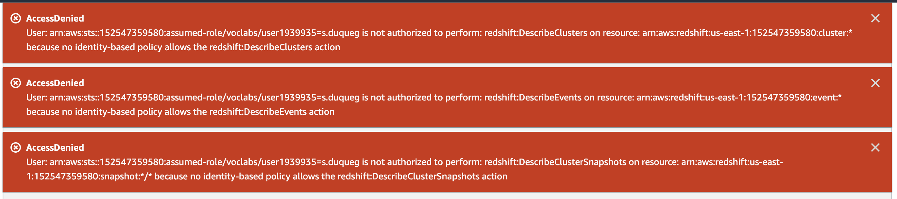

# Laboratorio 3 - Desarrollo de ETLs en AWS

## Objetivos

- Entender con un ejercicio práctico los fundamentos y componentes básicos de un proceso ETL.
- Extender y desplegar un proceso ETL encargado de extraer información transaccional para ser cargada en un modelo multidimensional en una bodega de datos.
- Familiarizarse con algunas herramientas del proveedor de nube AWS para el desarrollo y despliegue de ETLs como son S3, Glue y Redshift. 

## Herramientas

- [AWS S3](https://aws.amazon.com/es/s3/): Servicio nativo de *data lake* proporcionado por AWS.
- [AWS Glue](https://aws.amazon.com/es/glue/): Servcio de integración de datos escalable basado en Apache Spark.
- [AWS Redshift](https://aws.amazon.com/redshift/): Servicio nativo de bodega de datos proporcionado por AWS.
- [AWS Academy](https://www.awsacademy.com/vforcesite/LMS_Login): Plataforma de aprendizaje de AWS con acceso limitado a algunos de sus servicios.

## Importante: Antes de la sesión de laboratorio

Para poder llevar a cabo el laboratorio sin tener que crear una cuenta propia de AWS, solicitar créditos de forma individual ni generar gastos mediante tarjeta de crédito, asegúrese de que tiene acceso a [AWS Academy](https://www.awsacademy.com/vforcesite/LMS_Login). En días anteriores a la realización del laboratorio debió recibir vía correo electrónico las instrucciones y credenciales de acceso. Complementariamente, se recomienda seguir la guía de acceso a AWS Academy que se encuentra [aquí](AWS%20Academy%20Learner%20Lab%20-%20Student%20Guide%20v0.2.pdf).

Tenga en cuenta que el presente laboratorio se debe desarrollar y entregar en grupos, sin embargo, el acceso a AWS Academy es individual y cada estudiante contará con USD$100 para propósitos de experimentación. Estos créditos son más que suficientes para la realización del laboratorio.

## Caso de estudio

**WWI (Wide World Importers)** es una empresa distribuidora que ofrece productos variados a clientes retail y naturales al mayor y al detal en diferentes ciudades de Estados Unidos.

Actualmente, la empresa se encuentra contratando un servicio de consultoría de BI con el propósito de construir herramientas analíticas para la toma decisiones basadas en datos. Como proyecto piloto, con el objetivo de tener mayor visibilidad de sus procesos de inventario y ventas, WWI desea construir una bodega de datos en donde se incluya información histórica de las órdenes realizas por producto y tipos de empaque, agregadas por día. Adicionalmente, para WWI también es importante conocer cuanto generan las órdenes por dia en *Valor Bruto de la Mercancía (GMV)* .

Dado lo anterior, WWI contrata a su equipo de trabajo para que realice la implementación y despliegue de una bodega de datos y un proceso ETL que cumpla con el requerimiento planteado.

Más detalles del caso de estudio se pueden encontrar [aquí](https://learn.microsoft.com/en-us/sql/samples/wide-world-importers-what-is?view=sql-server-ver16).

## Arquitectura de la solución

Como requerimiento por parte de WWI, la solución debe ser desplegada en AWS ya que es su proveedor principal de infraestructura en la nube. El área de datos de la empresa le ha proporcionado un conjunto de archivos en formato CSV los cuales contienen la información a ser utilizada durante este proyecto piloto. Su equipo deberá cargar estos archivos al *data lake* (S3), desde donde el servicio de integración de datos (Glue) los lee para posteriormente transformarlos y cargarlos, mediante un esquema multidimensional a la bodega de datos (Redshift).

    
    
Figura 1. Arquitectura de la solución.

## Actividades

1. Se le ha proporcionado a través del siguiente [video](https://drive.google.com/file/d/1cnvZ7ksyO6AIm0m3NtRWn5DljFSv55iB/view?usp=sharing) las instrucciones básicas para la creación y puesta en funcionamiento de los servicios de AWS, descritos en la sección previa de arquitectura. Dado que es posible que surjan problemas al momento de subir el json, se comparte este [documento](InstruccionesModificacionJSON.pdf) que aclara el proceso de modificación. 
2. Adicionalmente, el video también incluye las instrucciones para la ejecución de un proceso ETL de base que se le ha proporcionado a su equipo, el cual puede obtener [aquí](uniandes-bi-lab3-processor.json). De igual manera, los datos los encuentra disponibles en este [enlace](data/). Como podrá observar en la interfaz de administración de Glue, el ETL proporcionado corresponde al siguiente:

    
    
Figura 2. Parte superior del proceso ETL.

 
    

    
    
Figura 3. Parte inferior del proceso ETL.

 

2. Analice los diferentes subprocesos del ETL proporcionado. Identifique los nodos o bloques para la extracción de datos desde S3, los diferentes filtros, *joins*, agregaciones y generadores de *PKs* que se encuentran implementados, así como los requeridos para la carga de datos a Redshift. Describa en sus propias palabras el proceso general implementado.

3. Extienda el ETL para incluir una nueva dimensión denominada PackageTypes utilizando el archivo CSV con el mismo nombre, más una nueva medida denominada TotalPrice la cual debe ser calculada multiplicando las columnas Quantity y UnitPrice del archivo OrderLines. Adjunte el diagrama de bloques final generado en Glue, así como el archivo JSON que se exporta desde la misma interfaz de administración. Documente el diseño de estos procesos ETL, utilizando la plantilla que está disponible en este [enlace](PlantillaDiseñoETL.xlsx).

***Importante:** Para evitar errores durante la ejecución consecutiva del ETL, se recomienda que elimine manualmente las tablas de Redshift antes de realizar una nueva ejecución. A pesar de que los nodos de carga de datos a tablas de Redshift están configurados para eliminar y volver a crear la tablas, se han experimentado errores cuando el esquema de los datos se modifica, como puede ser el caso de agregar una nueva columna o cambiar el tipo de dato de una existente. Recuerde que actividades de cambios en el esquema, no son comunes en la práctica normal y, que en este laboratorio se hizo de esta manera por razones pedagógicas.*

4. En un ejercicio de ingeniería inversa, reconstruya el modelo multidimensional que se genera en Redshift tras la correcta ejecución del ETL.

5. Diseñe y documente el resultado de al menos dos consultas SQL que permitan consultar las medidas implementadas filtrando por algunas de las diferente dimensiones disponibles.

6. Finalmente, responda las siguientes preguntas:
- ¿Qué ventajas y desventajs observa al momento de implementar un ETL utilizando este tipo de herramientas respecto a desarrollarlo utilizando Python, Pandas y demás herramientas vistas durante la primera parte del curso?
- A partir del resto de información contenida en los archivos CSV proporcionados, ¿qué otros análisis considera que se pueden soportar y cómo se traducirían a dimensiones y medidas sobre el actual modelo?
- ¿Qué errores se le presentaron en el desarrollo del laboratorio y qué solución plantearon? Haga énfasis en los que fueron más difíciles de solucionar.

## Instrucciones de Entrega

- La entrega se debe realizar en grupos de máximo 3 estudiantes.
- Recuerde hacer la entrega por la sección unificada en Bloque Neón, antes del domingo 14 de mayo a las 22:00. Este será el único medio por el cual se recibirán entregas.

## Entregables

- Evidencia de la correcta ejecución de los pasos de configuración y despliegue del ETL proporcionado.
- Descripción con sus propias palabras del paso a paso de extracción, transformación y carga de datos realizado por el ETL final. Incluir el diseño de ETL, utilizando esta [plantilla](PlantillaDiseñoETL.xlsx), de la extensión realizada en este laboratorio.
- Diagrama de bloques final generado en Glue, así como el archivo JSON que se exporta desde la misma interfaz de administración.
- Modelo multidimensional creado en Redshift.
- Consultas SQL utilizadas para obtener la información solicitada en la actividad 5 y evidencia de su correcta ejecución desde la interfaz gráfica de AWS Redshift.
- Respuestas a las preguntas planteadas.

## Rúbrica de Calificación

| Concepto | Porcentaje |
|:---:|:---:|
| Evidencia de la correcta ejecución de los pasos de configuración y despliegue | 10% |
| Descripción del paso a paso del ETL final | 10% |
| Diseño del ETL de la extensión realizada en este laboratorio | 10% |
| Diagrama de bloques y JSON del ETL final | 25% |
| Modelo multidimensional | 15% |
| Consultas SQL y evidencia de su correcta ejecución | 15% |
| Respuestas a las preguntas | 15% |

## Errores comunes
- Problemas para acceder al servicio de redshift, como se muestra en la siguiente figura:. Para resolver este problema, debe detener la consola, hacer logout de su cuenta AWS Academy e iniciar nuevamente la sesión. En caso de que persista el problema, intente nuevamente cerrar la sesión y reiniciar nuevamente. 

## Referencias

- Capítulo 20 (págs. 512-520). KIMBALL, Ralph, ROSS, Margy. “The Data Warehouse Toolkit: the definitive guide to dimensional modeling". Third Edition. John Wiley & Sons, Inc, 2013.
- (Opcional) Capítulo 11 (págs. 464-472) KIMBALL, Ralph, ROSS, Margy, BECKER, Bob, MUNDY Joy, and THORNTHWAITE, Warren. "The Kimball Group Reader: Relentlessly Practical Tools for Data Warehousing and Business Intelligence Remastered Collection". Wiley, 2016.
- [Arquitectura moderna de bodegas de datos](https://aws.amazon.com/es/big-data/datalakes-and-analytics/modern-data-architecture/)
- [Imagen de la propuesta de AWS](https://d1.awsstatic.com/webteam/category-pages/Analytics/lake-house/lake_house_why_diagram_inside_out.15d0589d776b9b5beca5e094370c58323da6e5f4.png)
- [Imagen de la propuesta de AWS y sus productos](https://d1.awsstatic.com/webteam/category-pages/Analytics/HIW-NEW.8bb7692b54072a8fa9da8c99566e0337df1b904a.png)
 
